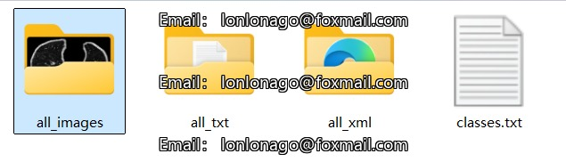
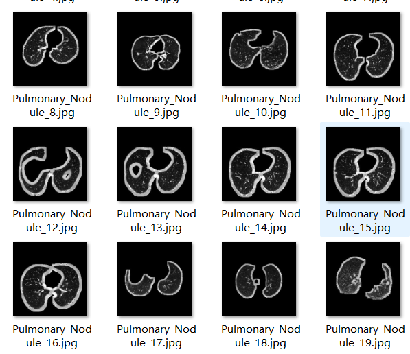
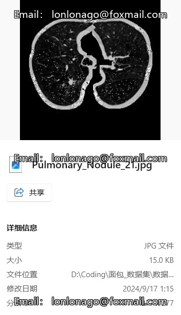
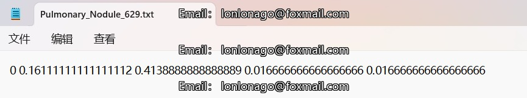
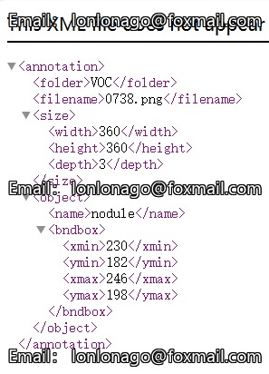
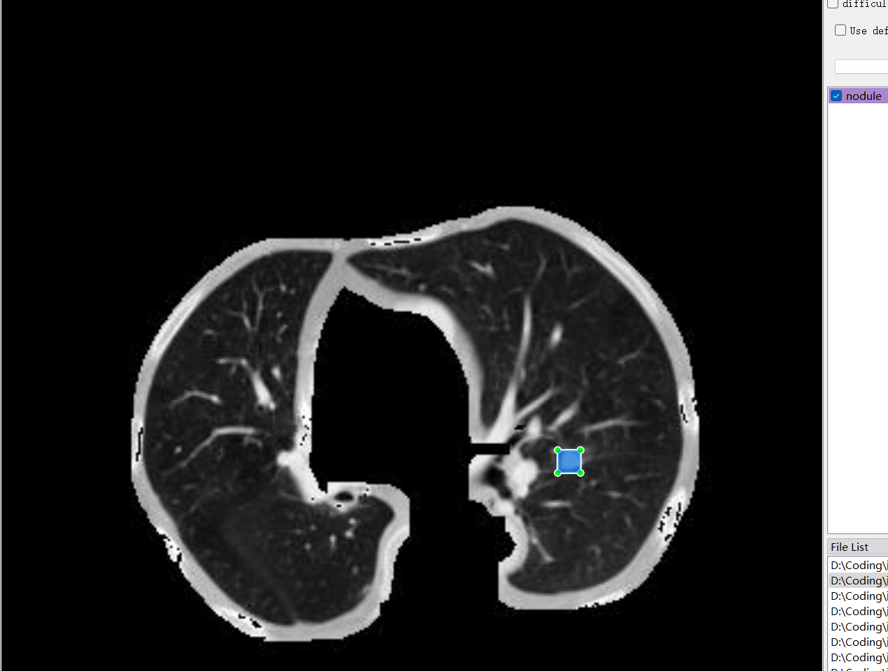

# Pulmonary Nodule Detection - Target Detection Dataset

Dataset Information Introduction: The dataset consists of 1,180 images and corresponding annotation files.
Annotation Files are available in two formats: VOC-formatted xml files and YOLO-formatted txt files.
The following types of annotations exist:
['nodule']
The number of bounding boxes for each object is as follows: (Annotations are usually in English with the Chinese provided in parentheses for reference)
nodule: 1,180
Note: An image may contain multiple objects, so the total number of bounding box annotations may be greater than the total number of images.
The complete dataset includes three folders and a txt file:
all_images: Stores the dataset's images, screenshots included:
Image size information:
all_txt and classes.txt: Store the yolo-formatted txt annotations, the number matches the number of images, each annotation file corresponds one-to-one.
classes.txt:
For a detailed understanding of the standard format of the yolo-formatted file, please search for it on your own. In short, the number 0 represents the name at the array index 0 in the classes.txt file.
all_xml: VOC-formatted xml annotations.
The numbers match the number of images, each annotation file corresponds one-to-one.
For a detailed understanding of the VOC-formatted standard file, please search for it on your own.
Both formats of annotations are usable; choose one according to your preference.
Annotation screenshots:

## Picture

Here is a pay link on Stripe ( https://buy.stripe.com/3cs8yP7sY87d0vu9AB ). Please contact me lonlonago@foxmail.com after funding $89, and I will send you a complete data files , thank you!

